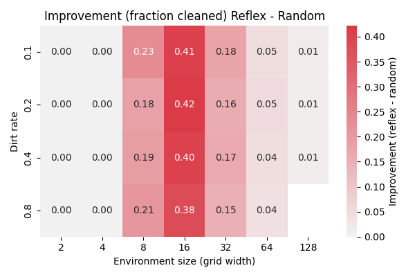

# Comparación de agentes: Random vs Reflex

## Descripción de los agentes

### RandomAgent
Agente que ejecuta acciones completamente aleatorias.  
En cada paso elige una acción entre moverse en alguna dirección, limpiar o quedarse inactivo.  
Su estrategia es simple, pero no aprovecha la información del entorno.

### ReflexiveAgent
Agente reflexivo simple.  
Si la celda actual está sucia, la limpia de inmediato.  
Si no lo está, se mueve en una dirección aleatoria.  
Esto asegura que siempre que encuentre suciedad, la eliminará, mejorando el rendimiento respecto al agente aleatorio.

## Resultados

La siguiente figura muestra la mejora relativa en la fracción de suciedad limpiada del agente **Reflex** frente al **Random**:

### Observaciones
- En **entornos pequeños (2x2, 4x4)** ambos agentes rinden igual, por lo que no hay mejora.  
- En **entornos medianos (8x8, 16x16)** el Reflex logra una gran ventaja, alcanzando hasta un **40% más de limpieza** que el Random.  
- En **entornos grandes (32x32 en adelante)** la mejora se reduce, ya que ninguno de los dos agentes explora de forma eficiente.  
- La tasa de suciedad (`dirt rate`) no altera mucho el patrón: el factor determinante es el tamaño del entorno.

## Conclusión
El **ReflexiveAgent** supera claramente al **RandomAgent**, sobre todo en entornos de tamaño medio.  
Esto demuestra que incluso reglas simples basadas en la percepción inmediata del entorno generan una mejora significativa frente a la aleatoriedad pura.
