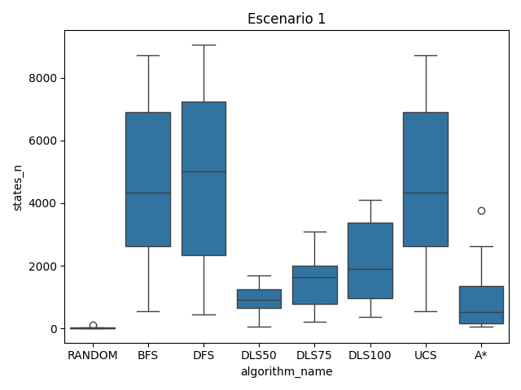
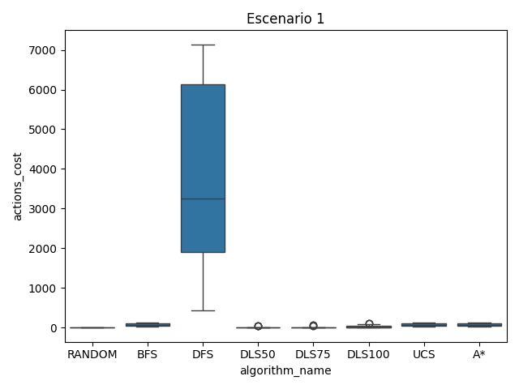
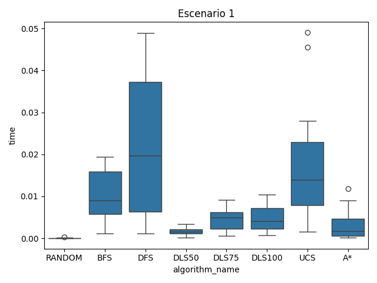
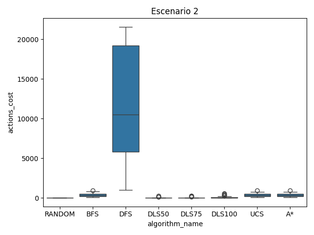
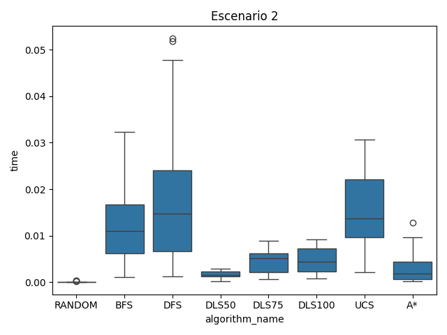

Informe de resultados — TP3 Algoritmos de Búsqueda

Resumen experimental

- Entornos: 30 instancias en grillas 20×20 con probabilidad 0.92 de celdas transitables.
- Algoritmos: RANDOM, BFS, DFS, DLS50, DLS75, DLS100, UCS, A*.
- Escenarios: (s1) costos uniformes; (s2) penalización a movimientos verticales.
- Métricas: `states_n` (estados explorados), `actions_count` (pasos), `actions_cost` (costo acumulado), `time` (segundos), `solution_found`.
- Datos crudos: `results.csv` contiene 480 corridas con columna `scenario` ∈ {1,2}.

Hallazgos clave

- A*: explora muchos menos estados y logra tiempos menores que UCS y BFS; mantiene costo óptimo en ambos escenarios.
- UCS: garantiza óptimo de costo; suele explorar más estados que A* y por ende tarda más.
- BFS: minimiza cantidad de pasos pero no necesariamente el costo en s2 (al penalizar verticales). En s1 coincide con UCS/A* en costo.
- DFS y DLS: tienden a expandir más estados y producir rutas más largas; con límites bajos (DLS50/75) frecuentemente no encuentran solución.
- RANDOM: rara vez encuentra solución y cuando lo hace no es competitivo.

Gráficos agregados

Escenario s1 (costos uniformes)

Escenario s2 (penalización vertical)

Lectura de las curvas

- En s1, BFS, UCS y A* producen caminos de igual longitud y costo; A* reduce sustancialmente `states_n` y `time` respecto de UCS.
- En s2, BFS mantiene pocos pasos pero el `actions_cost` puede ser mayor; UCS y A* optimizan el costo. A* se mantiene más eficiente en tiempo/expansiones.
- DFS sufre en ambos escenarios: altos `states_n`, rutas más largas y costos mayores; DLS100 mejora cobertura pero sin óptimo de costo.

Recomendaciones

- Usar A* con heurística admisible (p. ej., Manhattan) para lograr buen balance entre calidad de solución y eficiencia.
- Preferir UCS sólo cuando no se dispone de una heurística útil o se requieren garantías de óptimo sin heurística.
- Evitar DFS/DLS como estrategia principal en estos mapas; pueden servir como línea base o en dominios muy acotados.

Trazabilidad

- Resultados: `tp3-algoritmos-busqueda/results.csv`
- Imágenes: `tp3-algoritmos-busqueda/images/*.png`
