# Trabajo Práctico 4 — Búsqueda Local (N-Reinas)

Este informe resume la implementación y evaluación de cuatro algoritmos para N‑reinas: Hill Climbing (HC), Simulated Annealing (SA), Algoritmo Genético (GA) y un algoritmo Aleatorio (RANDOM). Se realizaron 30 corridas por tamaño de tablero n ∈ {4, 8, 10} con el mismo presupuesto de evaluaciones de H (max_states = 3000). Se omite el punto 8 (búsqueda y presentación de papers) según la consigna específica.

## Implementación

- HC: ascenso de colina canónico sobre representación de tamaño n, donde `board[c]` es la fila de la reina en la columna c. Movimiento: cambiar la fila de una columna. Política: entre vecinos que mejoran, se elige al azar dentro del top 5% (ponderado para favorecer H menor). Corta por H = 0, sin mejora local o por `max_states`.
- SA: vecino aleatorio (mover una reina a otra fila) y aceptación por Metropolis: siempre si ΔH ≤ 0, o con prob. `exp(-(ΔH)/T)` si ΔH > 0. Schedules usados: exponencial `T = T0·alpha^t` (con T0≈n, alpha=0.995, Tmin=1e-3) y lineal opcional. Criterios de terminación: H = 0, `max_states`, o `T <= Tmin` sin mejora.
- GA: individuos como permutaciones de 0..n-1 (una reina por columna y fila). Selección: torneo k (k≈log2(pop), acotado). Reemplazo: elitismo (≈ n·elite_frac elites, por defecto 0.5, sin reevaluar fitness). Operadores: cruce OX (order crossover) + mutación por swaps; alternativa uniforme+mutación para representación no permutacional. Terminación: solución (H=0), tope de generaciones auto‑ajustado al presupuesto de evaluaciones, o `max_states`.
- RANDOM: muestreo independiente de configuraciones hasta H=0 o `max_states`.

Código relevante en `tp4-busquedas-locales/code/`: `hill_climbing.py`, `simulated_annealing.py`, `genetic_algorithm.py`, `random_search.py`, `nqueens.py`, `run_experiments.py`.

## Configuración experimental

- Tamaños: n = 4, 8, 10; Semillas: 1..30; Presupuesto común: `max_states = 3000`.
- Métricas por corrida: `H`, `states` (evaluaciones de H), `time` (s). Resultados agregados en `tp4-busquedas-locales/tp4-Nreinas.csv`.
- Gráficos: boxplots de H, states y time por algoritmo y tamaño; trayectorias de H en una corrida (n=8, seed=1).

Imágenes en `tp4-busquedas-locales/images/`:

- Boxplots H: `images/boxplot_H_n4.png`, `images/boxplot_H_n8.png`, `images/boxplot_H_n10.png`
- Boxplots States: `images/boxplot_states_n4.png`, `images/boxplot_states_n8.png`, `images/boxplot_states_n10.png`
- Boxplots Time: `images/boxplot_time_n4.png`, `images/boxplot_time_n8.png`, `images/boxplot_time_n10.png`
- Trayectorias H (n=8, seed=1): `images/traj_HC_n8_seed1.png`, `images/traj_SA_n8_seed1.png`, `images/traj_GA_n8_seed1.png`, `images/traj_RANDOM_n8_seed1.png`, `images/traj_ALL_n8_seed1.png`

## Resultados (30 corridas por n)

Resumen agregado a partir de `tp4-Nreinas.csv`:

- n=4
  - GA: éxito 100.0%; H̄=0.000 (±0.000); states̄=30.6 (±10.5); timē=0.000187s (±0.000137)
  - SA: éxito 100.0%; H̄=0.000 (±0.000); states̄=92.8 (±80.9); timē=0.000427s (±0.000368)
  - HC: éxito 23.3%; H̄=0.833 (±0.531); states̄=28.8 (±9.3); timē=0.000098s (±0.000029)
  - RANDOM: éxito 100.0%; H̄=0.000 (±0.000); states̄=151.3 (±157.6); timē=0.000872s (±0.000911)
- n=8
  - GA: éxito 100.0%; H̄=0.000 (±0.000); states̄=322.9 (±205.6); timē=0.005586s (±0.003710)
  - SA: éxito 83.3%; H̄=0.167 (±0.379); states̄=1048.0 (±443.5); timē=0.009232s (±0.003959)
  - HC: éxito 10.0%; H̄=1.200 (±0.664); states̄=239.5 (±48.2); timē=0.001722s (±0.000343)
  - RANDOM: éxito 0.0%; H̄=1.567 (±0.504); states̄=3000.0 (±0.0); timē=0.036175s (±0.004071)
- n=10
  - GA: éxito 83.3%; H̄=0.167 (±0.379); states̄=1237.8 (±954.2); timē=0.028711s (±0.022097)
  - SA: éxito 66.7%; H̄=0.333 (±0.479); states̄=1373.7 (±415.1); timē=0.016482s (±0.004890)
  - HC: éxito 0.0%; H̄=1.567 (±0.626); states̄=476.2 (±118.7); timē=0.005106s (±0.001616)
  - RANDOM: éxito 0.0%; H̄=2.600 (±0.498); states̄=3000.0 (±0.0); timē=0.055693s (±0.011746)

### Boxplots

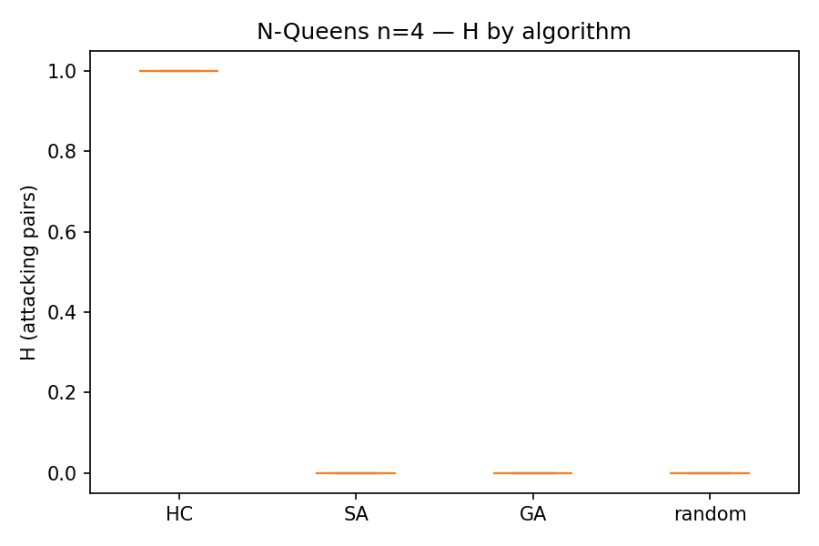
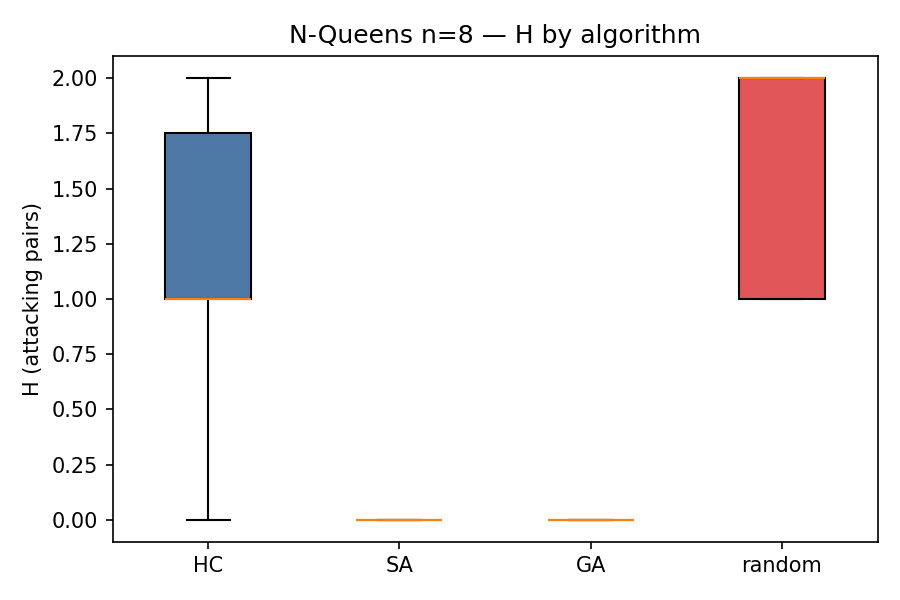
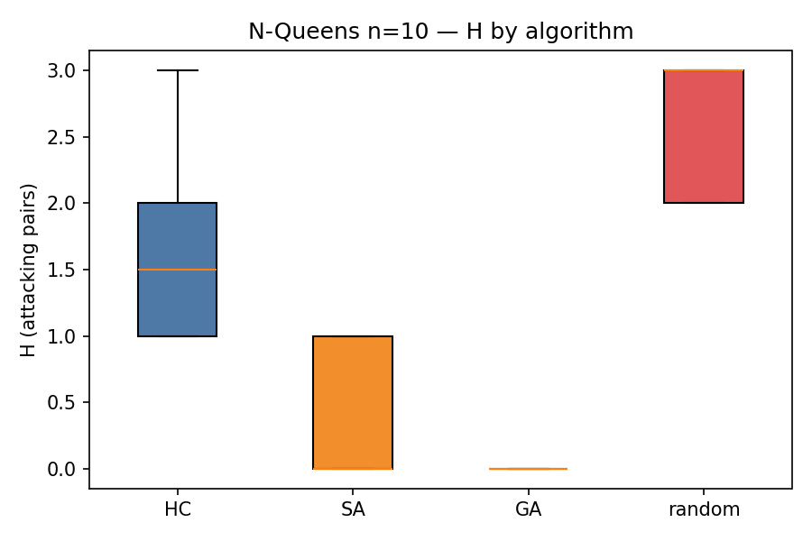

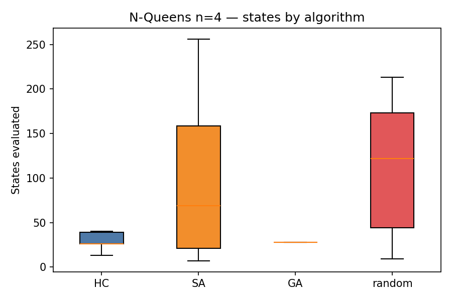
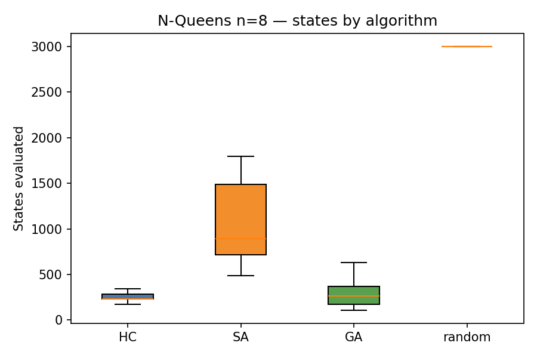
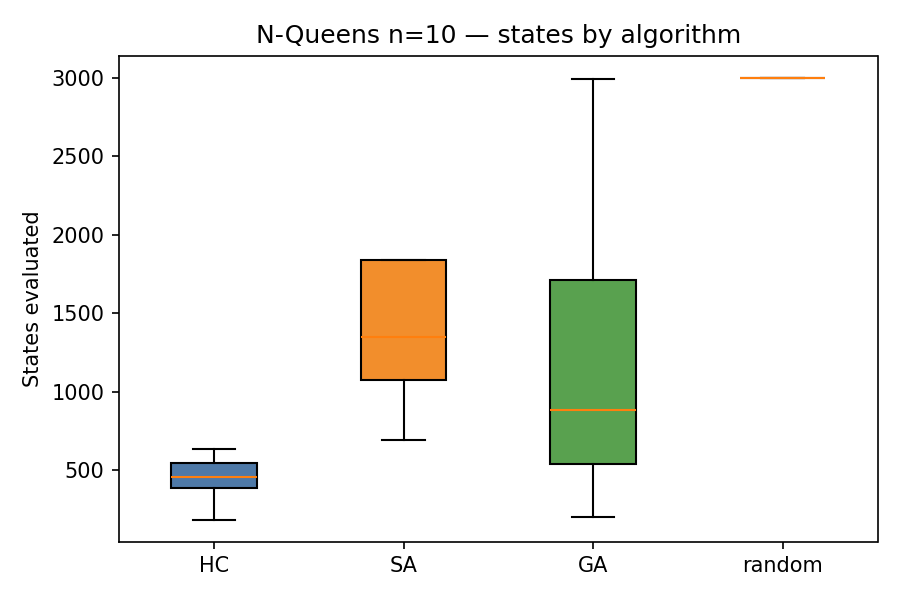

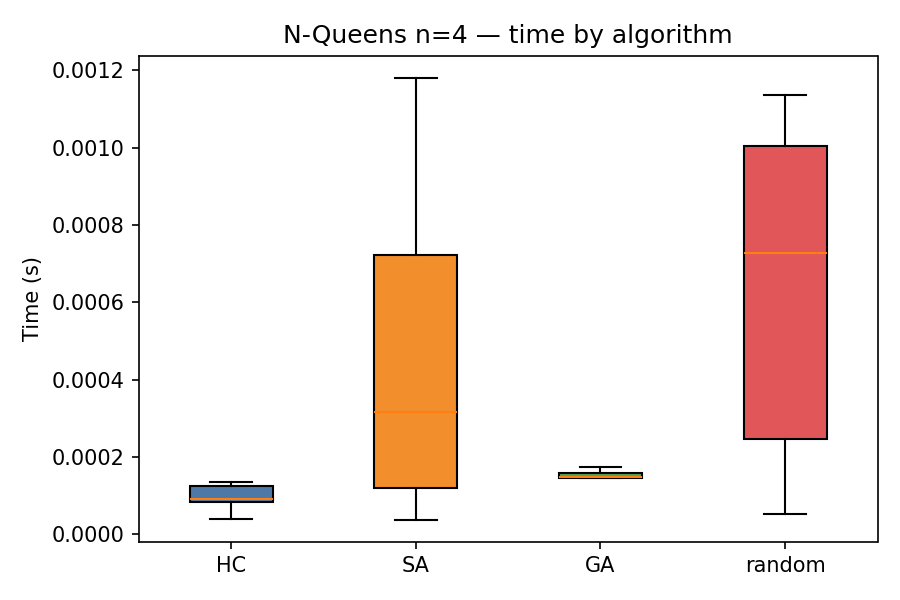
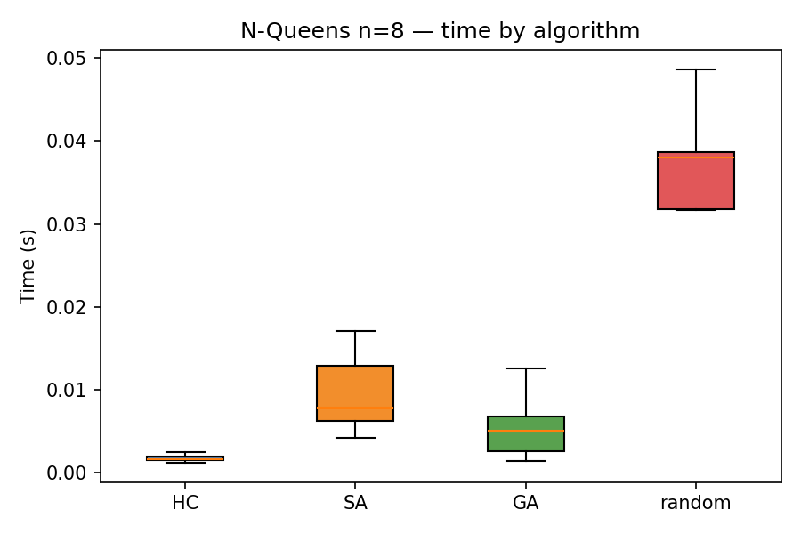
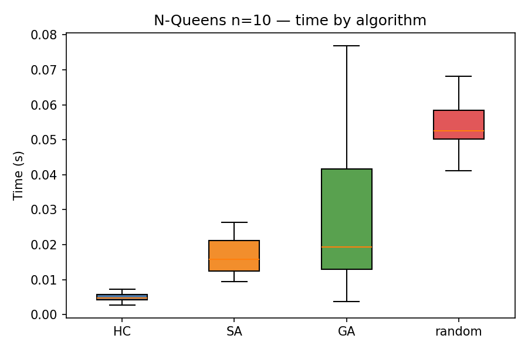

### Trayectorias H (una corrida: n=8, seed=1)

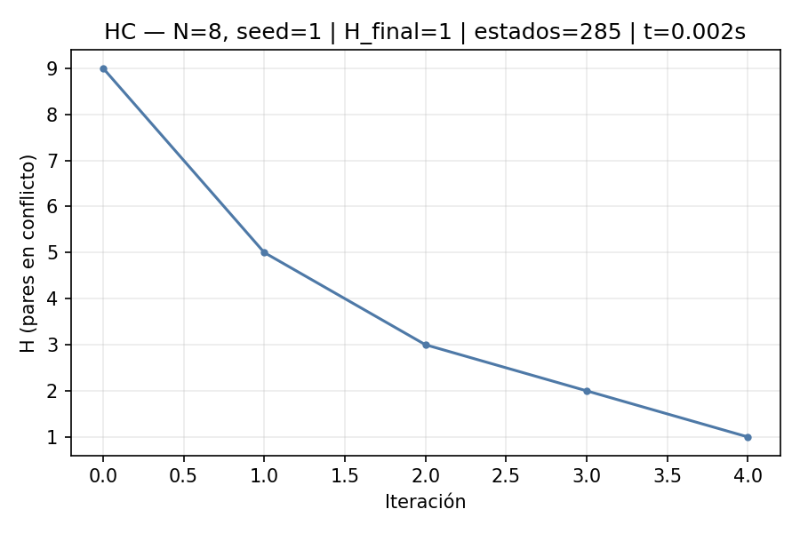
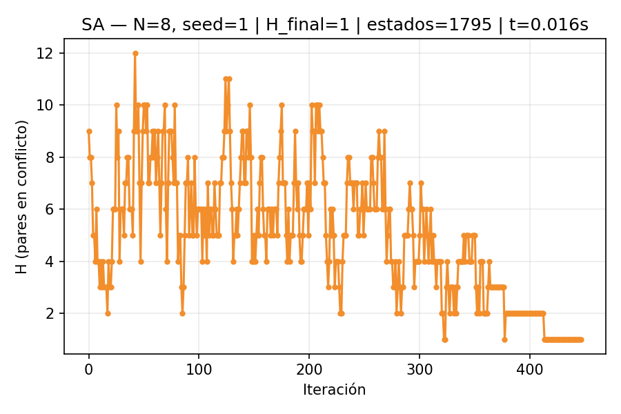
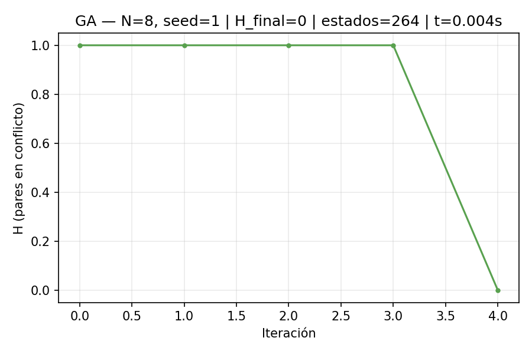
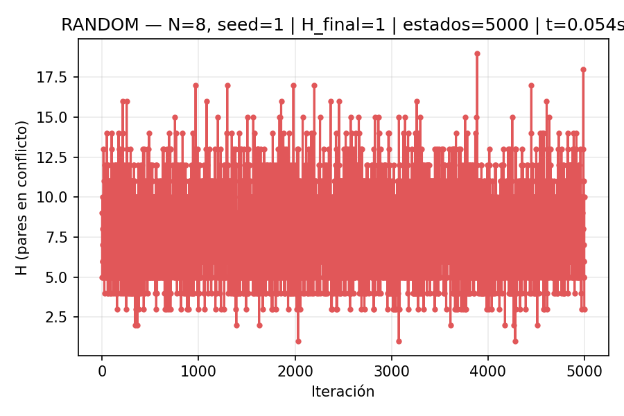

Comparativa directa:

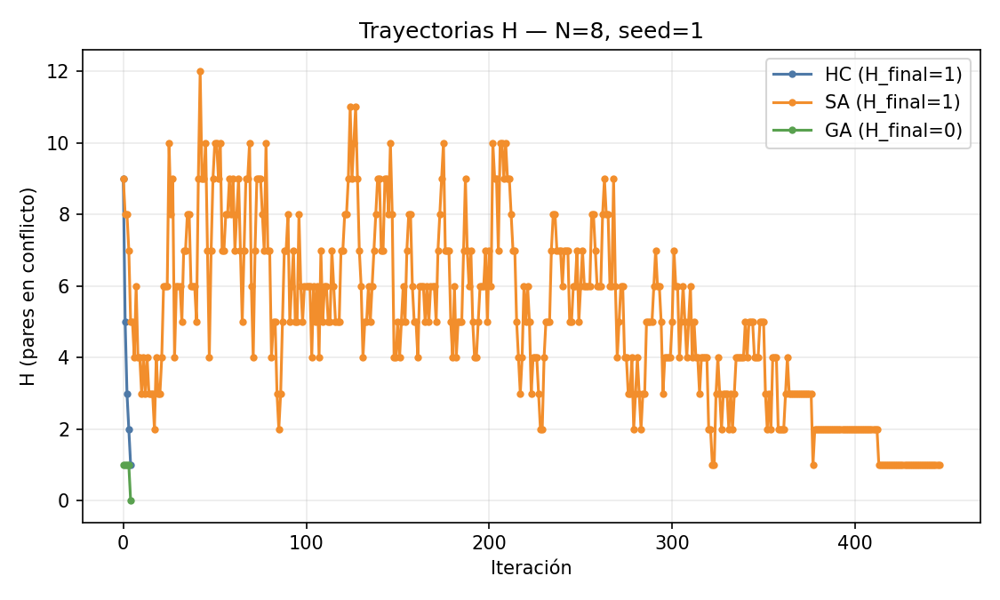

## Discusión y conclusiones

- Fiabilidad y calidad de solución: GA obtiene las mayores tasas de éxito y H=0 con alta consistencia en n=8 y buen desempeño en n=10, superando a SA y, mucho más, a HC y RANDOM.
- Coste computacional: SA evalúa más estados que GA en n=4 y n=8, pero en n=10 muestra menor tiempo promedio que GA bajo este presupuesto (posible convergencia con menos trabajo por evaluación o trayectoria más directa). HC es muy rápido por iteración, pero se estanca con frecuencia.
- Sensibilidad de hiperparámetros: SA depende del schedule (T0, alpha/Tmin o lineal) y puede ajustarse para priorizar rapidez o exploración; GA permite modular presión selectiva, elitismo y tasa de mutación.

Conclusión: dependiendo del objetivo, el algoritmo “mejor” puede ser SA o GA.
- Si el objetivo principal es maximizar la tasa de soluciones óptimas (H=0) y la robustez general, GA es preferible.
- Si se busca rapidez bajo ciertos tamaños o presupuestos (p. ej., n=10 en estos experimentos) y se dispone de un buen schedule, SA puede ser competitivo e incluso más veloz en tiempo promedio.

## Entregables y estructura

- Código: `tp4-busquedas-locales/code/`
- CSV de resultados: `tp4-busquedas-locales/tp4-Nreinas.csv`
- Reporte: `tp4-busquedas-locales/tp4-reporte.md`
- Imágenes: `tp4-busquedas-locales/images/`
- (Se omite `tp4-research.pdf` del punto 8 por indicación específica.)

